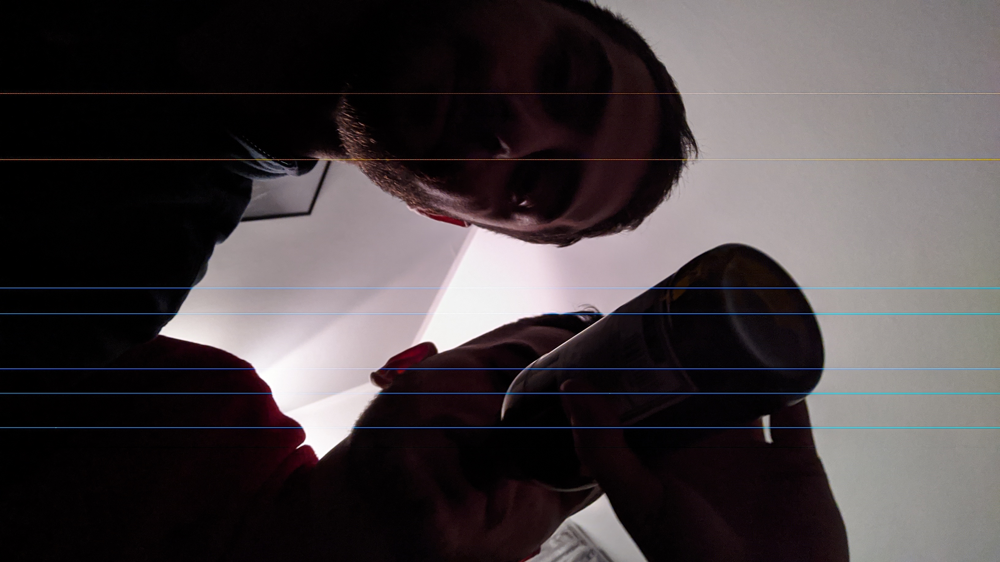

# cmrhack
Android app for resolving vertical line camera issue on Xiaomi Mi A3.

## Description
The goal of the app is to eliminate hot pixels produced by a faulty Xiaomi Mi A3 selfie camera sensor.
The app should be able to read a camera image stored in the device, process the image and then save/replace the input file with the generated file.

## Approach
Inside the core of the app a simple image processing algorithm is developed in order to replace the corrupted pixels.
We know as a rule that such pixels are only present in the form of vertical lines or strips in the generated selfie image file.
Thus, the algorithm includes the following sequence of operations :
- For each row:
  1. Read the color values of the strip's left and right pixels 
  2. For each intermediate pixel use linear interpolation to determine its value
  3. Add a random factor in each pixel inside the strip
  4. Keep pixel values in the appropriate range (0-255)

## Interface
For the implementation of the algorithm described above, the following Java method is used:
```java
/**
Eliminate vertical strip of hot pixels in an image.
@param x1 horizontal coordinate of the first pixel (left) of the vertical strip range
@param x2 horizontal coordinate of the last pixel (right) of the vertical strip range
@param rand random permutation to be applied in every pixel of the strip
@param neigh number of strip's neighbor pixels that will be taken into account
@return void
*/
void setStrip(int x1, int x2, int rand, int neigh);
```

## Demonstration
An example of the application's results is presented below :
Input image | Output image 
--- | ---
 | 
